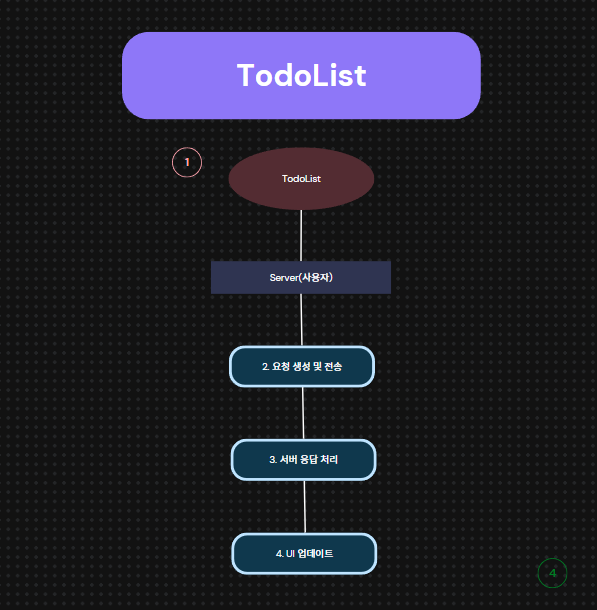
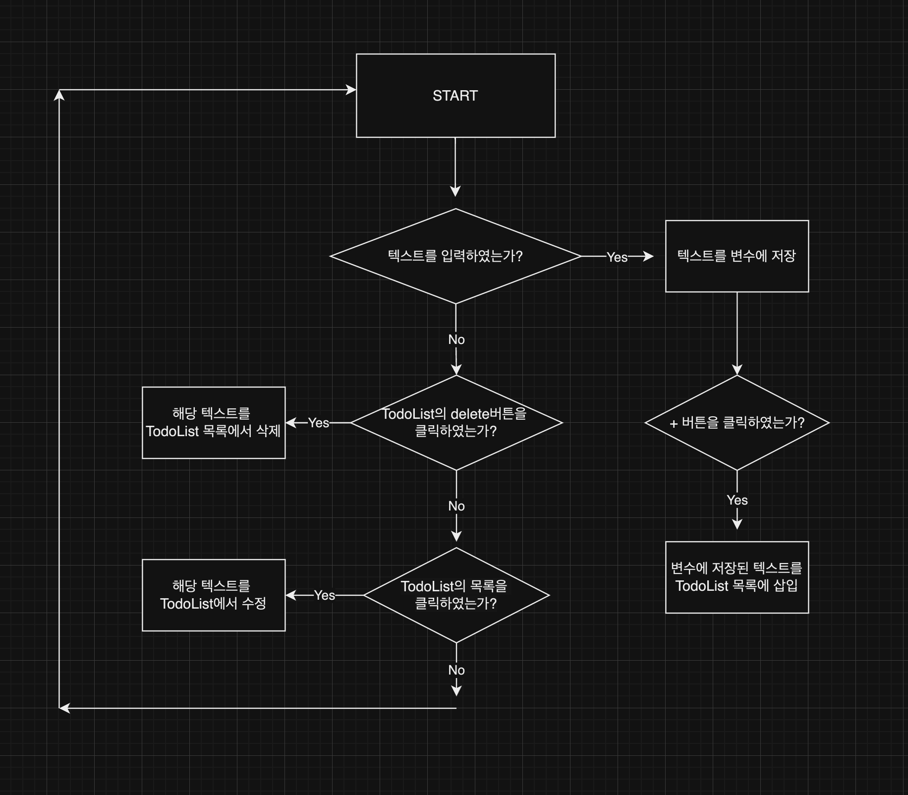
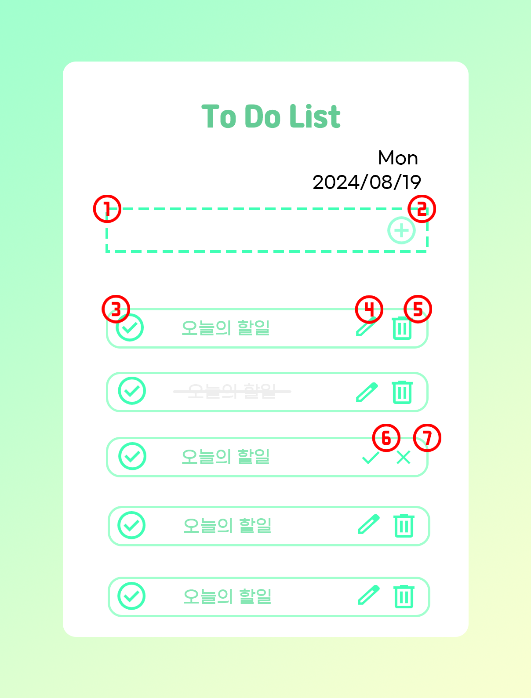

# 🗒️ To Do List

프로그래머스 데브코스 프론트엔드 1차 프로젝트

 

# 🚀사용 기술

 

## ✅프로젝트 개요

배경 : 프론트엔드 기초 학습을 프로젝트 제작을 통해 학습의 정도를 확인하고 추가로 필요한 부분을 채우기 위해 해당 미니 프로젝트를 기획하게 되었습니다.

1. 프로젝트 특징
2. 다른 투두리스트 장단점
3. 확인할 수 있던 점 / 배울 수 있던 점
4. 메뉴 구성도 (flow chart)
5. 주요 기능 (CRUD)
6. 기대 효과 / 활용 분야 / 주요 사용자(예상 사용자)
7. 화면 설계서

## 1) 프로젝트 특징

Create : 할 일 입력

Read : 할 일 목록

Update : 수정 버튼

Delete : 삭제 버튼

- 현재 날짜와 요일을 출력한다.
- 할 일 왼쪽의 체크 아이콘을 클릭하면 취소선과 글씨가 불투명해진다.

## 2) 해당 투두 리스트의 장점

1. 요일을 확인할 수 있다.
2. 체크 박스를 통해 끝마친 일을 구분할 수 있다.

## 3) 확인 할 수 있던 점 / 배울 수 있던 점

1. HTML의 다양한 태그를 사용할 수 있다.
   1. div / input / ul / li / section / span / footer등을 사용할 수 있다.
2. CSS
   1. flex / position / hover / margin / justify-content / transform 등을 사용할 수 있다.
3. JavaScript
   1. Event / DOM 등 JS 함수와 메소드를 활용할 수 있다.

## 4) 메뉴 구성도 (Flow Chart)

### 1) 연동 흐름도

### 2) 화면 흐름도

## 5) 주요 기능 (CRUD)

1. 인풋 : 해야 할 일 입력받는 입력창
2. 인풋 추가버튼 : 해야 할 일을 입력 했다면 추가하는 버튼
3. 완료 체크박스 : 해야 할 일을 완료 했다면 버튼을 클릭하여 아직 하지 않은 일과 구분한다.
4. 수정 버튼 : 버튼을 클릭하여 해야 할 일을 수정한다.
5. 삭제 버튼 : 버튼을 클릭하여 해야 할 일을 삭제한다.
6. 수정 완료 버튼 : 버튼을 클릭하여 수정한 해야 할 일을 저장한다.
7. 수정 취소 버튼 : 버튼을 클릭하여 수정한 해야 할 일을 저장 하지 않는다.

## 6) 기대 효과 / 활용 분야 / 주요 사용자 (예상 사용자)

- 기대 효과
  - 시간 관리: 일정 관리를 통해 시간을 효율적으로 사용할 수 있음
  - 목표 달성: 달성해야할 목표를 시각적으로 확인할 수 있음
  - 업무의 효율성 향상: todolist를 통해 해야할 일을 정리함으로써 업무를 더 체계적으로 관리할 수 있음
- 활용 분야
  - 개인 일정 관리
  - 업무 관리
  - 이벤트 관리 등
- 주요 사용자
  - 직장인
  - 학생
  - 팀 리더 및 프로젝트 관리자 등

## 7) 화면 설계서



1. 인풋 : 해야 할 일 입력받는 입력창
2. 인풋 추가버튼 : 해야 할 일을 입력 했다면 추가하는 버튼
3. 완료 체크박스 : 해야 할 일을 완료 했다면 버튼을 클릭하여 아직 하지 않은 일과 구분한다.
4. 수정 버튼 : 버튼을 클릭하여 해야 할 일을 수정한다.
5. 삭제 버튼 : 버튼을 클릭하여 해야 할 일을 삭제한다.
6. 수정 완료 버튼 : 버튼을 클릭하여 수정한 해야 할 일을 저장한다.
7. 수정 취소 버튼 : 버튼을 클릭하여 수정한 해야 할 일을 저장 하지 않는다.

## 팀원 GitHub 링크 (개인 제작)

염승환 : https://github.com/yeomseunghwan/dev_todolist

김혜준 : https://github.com/hyejun-fe/devcourse_project1_todolist

임재현 : https://github.com/JaeHyun10-03/Dev-Project1-TodoList

차주영 : https://github.com/verynicetomato/TO_DO_LIST
